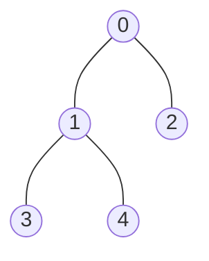

>[!WARNING]
>알고리즘의 DFS,BFS와 구분되는 내용

>[!NOTE]
>DFS와 BFS에 대한 기본적인 내용은 어느정도 알고 읽는걸 권장

# <font color="orange">DFS(깊이 우선 탐색)</font>


### <font color="orange">전체 코드</font>

```C
#include <stdio.h>
#include <stdlib.h>

#define MAX_VER 20
#define STACK_MAX 20

typedef int stacks;

typedef struct{
	int num_ver;
	int ad_mat[MAX_VER][MAX_VER];
}G_TYPE;

int visited[MAX_VER];

void reset_mat(G_TYPE* one){
	one->num_ver = 0;
	int x, y;
	for (x = 0; x < MAX_VER; x++){
		for (y = 0; y < MAX_VER; y++){
			one->ad_mat[x][y] = 0;
		}
	}
}

void in_ver(G_TYPE* one, int ver) {
	if ((one->num_ver) + 1 > MAX_VER) {
		printf("overflow\n");
		return;
	}
	else
		one->num_ver++;
}

void in_ed(G_TYPE* one, int from, int to) {
	if (from >= one->num_ver || to >= one->num_ver) {
		printf("Error\n");
		return;
	}
	one->ad_mat[from][to] = 1;
	one->ad_mat[to][from] = 1;
}

//Stack

typedef struct{
	int top;
	stacks data[STACK_MAX];
}Stacktype;

void reset_stack(Stacktype* two){
	two->top = -1;
}

int empty(Stacktype* two){
	if (two->top == -1){
		return 1;
	}
	else
		return 0;
}

int full(Stacktype* two){
	if (two->top == STACK_MAX - 1){
		return 1;
	}
	else
		return 0;
}

void push(Stacktype* two, stacks input){
	if (full(two) == 1){
		printf("full\n");
	}
	else
		two->data[++(two->top)] = input;
}

stacks pop(Stacktype* two){
	if (empty(two) == 1){
		printf("empty\n");
	}
	else
		return two->data[(two->top)--];
}

//DFS

void DFS_MAT(G_TYPE* one, int pic)
{
	Stacktype two;
	reset_stack(&two);

	push(&two, pic);
	printf("%d\n", pic);
	
	visited[pic] = 1;

	while (!empty(&two)){
		int pre = pop(&two);
		if (visited[pre] == 0) {
			visited[pre] = 1;
			printf("%d\n", pre);
		}

		for (int i = one->num_ver - 1; i >= 0; i--) {
			if (one->ad_mat[pre][i] == 1 && visited[i] == 0){
				printf("%d\n", i);
				push(&two, i);
				visited[i] = 1;
			}
		}
	}
}


int main(void){
	G_TYPE* one;
	one = (G_TYPE*)malloc(sizeof(G_TYPE));
	reset_mat(one);

	in_ver(one, 1);
	in_ver(one, 2);
	in_ver(one, 3);
	in_ver(one, 4);
	in_ver(one, 5);

	in_ed(one, 0, 1);
	in_ed(one, 0, 2);
	in_ed(one, 1, 3);
	in_ed(one, 1, 4);

	DFS_MAT(one, 0);
	free(one);
	return 0;
}
```

### <font color="orange">코드 해석</font>

```C
#include <stdio.h>
#include <stdlib.h>

#define MAX_VER 20
#define STACK_MAX 50
```

헤더파일 선언 `<stdio.h>`는 표준 입출력 관련 헤더 파일이라 많이 사용했지만 `<stdlib.h>`는 많이 생소할 것이다. 나중에 `malloc`이나 `free`와 관련하여 설명할 것이니 지금은 넘어간다.

`MAX_VER`는 인접 행렬을 나타내는 배열의 행, 열의 수 상한을 정해놓은 것이다.
`STACK_MAX`는 스택을 구현할 때 사용한 방법 참고, 스택의 최대 크기를 나타낸 것이다. 사실 20으로 정해도 상관없다.

<hr>

#### <font color="orange">C언어에서 그래프를 나타내는 방법</font>

```C
typedef int stacks;

typedef struct{
	int num_ver;
	int ad_mat[MAX_VER][MAX_VER];
}G_TYPE;

int visited[MAX_VER];
```

고급 수학에서 배운 인접행렬로 나타낸다. `MAX_VER` $\times$ `MAX_VER` 이 행렬의 크기가 된다.

먼저 `G_TYPE`이라는 구조체 자료형를 정의한다. `num_ver`는 그래프에서 꼭짓점의 개수이고, `ad_mat`가 2차원 배열로 정의된 인접행렬이다.

각 꼭짓점에 대해 탐색을 진행했는지 확인하기 위해서 `visited`라는 배열을 정의한다. 해당 인덱스에 해당하는 노드에서 방문하지 않았으면 0 방문했으면 1로 나타내진다.

<hr>

```C
void reset_mat(G_TYPE* one){
	one->num_ver = 0;
	int x, y;
	for (x = 0; x < MAX_VER; x++){
		for (y = 0; y < MAX_VER; y++){
			one->ad_mat[x][y] = 0;
		}
	}
}
```

그래프를 초기화하는 함수이다. `G_TYPE` 자료형(구조체)을 가리키는 구조체 포인터 `one`을 인수로 받는다.

`G_TYPE`에서 꼭짓점의 개수를 나타내는 `num_ver`를 0으로 초기화 하고, 인접행렬 `ad_mat`의 모든 원소를 이중 반복문(인접행렬이 2차원 배열로 정의되었으므로)을 이용해 0으로 초기화한다.

<hr>

```C
void in_ver(G_TYPE* one, int ver) {
	if ((one->num_ver) + 1 > MAX_VER) {
		printf("overflow\n");
		return;
	}
	else
		one->num_ver++;
}
```

그래프에 꼭짓점을 추가하는 함수이다. 구조체 포인터 `one`과 꼭짓점의 번호에 해당하는 정수형 변수`ver`를 인수로 받는다. (근데 `ver`는 안씀)

만약 `num_ver`가 가리키는 인덱스가 `MAX_VER - 1`과 같다면 이는 정해둔 최대 꼭짓점의 수 20만큼의 꼭짓점이 이미 그래프에 추가되어져 있다는 뜻이다. 따라서 "overflow"를 출력한다.

`num_ver`의 값이 19(`MAX_VER = 20`이므로 인덱스는 19가 최대)가 아니라면 `num_ver`의 수를 1 증가시킨다.

<hr>

```C
void in_ed(G_TYPE* one, int from, int to) {
	if (from >= one->num_ver || to >= one->num_ver) {
		printf("Error\n");
		return;
	}
	one->ad_mat[from][to] = 1;
	one->ad_mat[to][from] = 1;
}
```

`in_ver`가 꼭짓점(vertex)를 추가하는 함수 였다면 `in_ed`는 변(edge)를 추가하는 함수이다. 구조체 포인터 `one`과 변이 연결하는 두 꼭짓점의 번호 `from`, `to`를 인수로 받는다 `from`과 `to`의 순서는 바뀌어도 된다.

`||`는 or 연산자이다. 만약 추가하는 변이 존재하지 않은 인덱스를 연결한다면 입력이 잘못된것이므로 "Error"를 출력한다.

올바른 `from`과 `to`를 입력했다면 인접행렬의 해당 원소값을 1로 바꾼다. 이때 인접 행렬 $M$에서 $M_{ij} = M_{ji}$ 이므로 `one->ad_mat[from][to] = 1;`, `one->ad_mat[to][from] = 1;`과 같이 값을 바꾼다.

<hr>

**스택 코드는 생략**

>그래프를 처리하는데 구조체 `G_TYPE`을 가리키는 구조체 포인터 `one`을 사용하였으므로, 스택의 구조체 `Stacktype`를 가리키는 구조체 포인터는 `two`로 바꿈

<hr>

```C
void DFS_MAT(G_TYPE* one, int pic)
{
	Stacktype two;
	reset_stack(&two);

	push(&two, pic);
	printf("%d\n", pic);
	
	visited[pic] = 1;

	while (!empty(&two)){
		int pre = pop(&two);
		if (visited[pre] == 0) {
			visited[pre] = 1;
			printf("%d\n", pre);
		}

		for (int i = one->num_ver - 1; i >= 0; i--) {
			if (one->ad_mat[pre][i] == 1 && visited[i] == 0){
				printf("%d\n", i);
				push(&two, i);
				visited[i] = 1;
			}
		}
	}
}
```

DFS를 실행하는 함수 `DFS_MAT`이다. 그래프 구조체를 가리키는 구조체 포인터 `one`과 탐색을 시작할 꼭짓점의 인덱스 `pic`을 인수로 받는다.

스택 `two`를 선언하고 쓰레기 값을 비우기 위해 초기화를 해준다. `reset_stack(two)`라 하지 않는 이유는 `two`는 구조체 포인터가 아닌 스택의 이름이기 때문이다.

DFS를 시작하기 위해 `push`함수를 이용해 `pic`값을 스택에 push 해준다. DFS의 작동 결과를 알기 위해서 `pic`값을 출력해준다. `pic`에 해당되는 꼭짓점은 탐색한 것이므로 `visited`의 `pic`번째 인덱스 원소 값을 1로 바꿔준다.

스택이 비어 있을때까지 다음의 반복문을 실행한다.

1. 스택에 pop 연산을 시행한다. 스택은 LIFO(Last in First Out)형식의 자료구조이므로 마지막으로 push된 원소가 pop된다. 이 원소를 반복문 내에서 `pre`라 정의한다.
2. 만약 `pre`가 방문하지 않은 꼭짓점이라면 `pre`의 값을 출력한다.
3. `pre`와 연결된 꼭짓점들 중에서 `visited`의 값이 0(방문되지 않음)인 꼭짓점을 찾아 스택에 push 해준다. 그리고, 해당 꼭짓점을 방문 처리한다.

<hr>

```C
int main(void){
	G_TYPE* one;
	one = (G_TYPE*)malloc(sizeof(G_TYPE));
	reset_mat(one);

	in_ver(one, 1);
	in_ver(one, 2);
	in_ver(one, 3);
	in_ver(one, 4);
	in_ver(one, 5);

	in_ed(one, 0, 1);
	in_ed(one, 0, 2);
	in_ed(one, 1, 3);
	in_ed(one, 1, 4);

	DFS_MAT(one, 0);
	free(one);
	return 0;
}
```

**메인함수**

그래프를 가리키는 구조체 포인터의 이름은 `one`이다.

`one = (G_TYPE*)malloc(sizeof(G_TYPE))` 에서 `stdlib.h`를 사용한 이유를 알 수 있다. `malloc`이 `stdlib.h`에 내장된 함수이기 때문이다.

이는 `G_TYPE`에 메모리를 동적으로 할당하는 방법이다. `sizeof(G_TYPE)`은 구조체 `G_TYPE`이 메모리에서 차지하는 크기를 의미하고 이를 `malloc` 함수를 이용해 힙 영역에 저장한다. `malloc`의 반환값이 `G_TYPE*` 으로 구조체 포인터가 되고 이를 `one`에 대입 해준것이다.

근데 사실 이미 `MAX_VER`를 20으로 정의해놔서 동적으로 이거 선언해봤자 그리 큰 쓸모가 없다.

DFS를 실행하기전, 인접행렬을 초기화 해주고 `num_ver`의 수도 0으로 초기화한다.

`in_ver` 와 `in_ed`를 통해 완성된 그래프의 모양은 다음과 같다.


`DFS_MAT(one, 0)`를 이용해 0번 꼭짓점부터 DFS를 시작하면 다음과 같은 결과가 나온다.

**1단계**
`two = {0}` 이므로 `two`에서 0을 pop, 0 출력, 꼭짓점 0과 연결된 꼭짓점이 1,2 이므로 `two = {1, 2}`

**2단계**
`two = {1, 2}` 이므로 가장 나중에 push된 2를 pop, 2 출력 꼭짓점 2와 연결된 꼭짓점이 0이나 이미 방문 했으므로 `two = {1}`

**3단계**
`two = {1}`이므로 1을 pop, 1 출력, 1단계와 마찬가지로 꼭짓점 1과 연결되어 있는 꼭짓점 3, 4를 push, `two = {3, 4}`

**4단계**
`two = {3, 4}` 이므로 마지막으로 push된 원소 4를 pop, 출력, 4와 연결된 꼭짓점 1이 있으나 이미 방문했으므로 `two = {3}`

**5단계**
`two = {3}`, 3을 pop하고 출력 3과 연결된 꼭짓점 1이 있으나 이미 방문하였으므로 `two = {}` 스택이 비었기 때문에 DFS 종료

**최종 결과**
```
0
2
1
4
3
```
## <font color="orange">BFS(너비 우선 탐색)</font>


