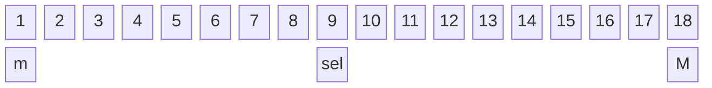
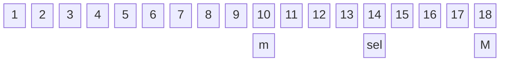
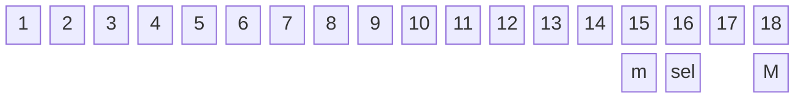

### <font color="orange"> 개요</font>

이진 탐색은 정렬된 배열의 값들 중 원하는 값이 어느 인덱스에 있는지 찾기 위한 알고리즘이다. **이 알고리즘을 사용하기 위해서는 무조건 배열이 정렬 되어 있어야 한다.**

시간 복잡도는 $O(\log N)$

[심심하면 참고(이진탐색 심화편)](https://witch.work/ko/posts/binary-search-next-step)
### <font color="orange"> 구현</font>

- C++/C99
```c++
int find(int s, int e, int target){
	while(s != e){
		int mid = (s + e) / 2;
		if(arr[mid] < target) e = mid;
		else if(arr[mid] > target) s = mid + 1
		else return mid;
	}
	if(arr[s] == target) return s;
	else return -1;
}
```

<hr>

- Upper Bound, Lower Bound - C++
```c++
#include <bits/stdc++.h> 
#define fastio cin.tie(0)->sync_with_stdio(0) 
using namespace std;
int LowerBound(const vector<int>& v, int x) { 
	const int n = v.size();
	int lo = -1, hi = n;
	while (lo + 1 < hi) { 
		int mid = (lo + hi) / 2; 
		if (!(v[mid] >= x)) lo = mid; 
		else hi = mid; 
	} 
	return hi; 
} 

int UpperBound(const vector<int>& v, int x) {
	const int n = v.size();
	int lo = -1, hi = n;
	while (lo + 1 < hi) { 
		int mid = (lo + hi) / 2; 
		if (!(v[mid] > x)) lo = mid; 
		else hi = mid; 
	} 
	return hi; 
} 

int main() { 
	fastio; vector<int> v = { 1, 2, 3, 3, 4 };
	cout << LowerBound(v, 3) << '\n'; // 2 
	cout << UpperBound(v, 3) << '\n'; // 4 
	cout << UpperBound(v, 3) - LowerBound(v, 3) << '\n'; // 2 }
```
>algorithm 헤더에 std::upper_bound, std::lower_bound가 구현되어있기 때문에 굳이 구현 안하고 써도 된다.

- lower_bound는 `v[i - 1] < k <= v[i]`인 i를 찾아주는 함수로, `v[i] >= k`인 `i`의 최솟값을 반환한다. 만약 `v`의 모든 원소가 `k`보다 작다면 `v`의 마지막 다음 칸의 위치를 반환한다.

- upper_bound는 `v[i - 1] <= k < v[i]`인 `i`를 찾아주는 함수로 `v[i] > k`인 `i`의 최솟값을 반환한다. 이 경우에도 `v`의 모든 원소가 `k`보다 작거나 같다면 `v`의 마지막 다음 칸의 위치를 반환한다.

<hr>

- C99(지극히 교과서적인 구현??)
```C
#include<stdio.h>

int main() {
    int list[] = { 1, 2, 3, 4, 5, 6, 7, 8, 9, 10, 11, 12, 13, 14, 15, 16, 17, 18 };
    int key = 16;
    int min = 0;
    int max = sizeof(list) / sizeof(list[0]) - 1;

    int sel = (min + max) / 2;

    while (min <= max) {
        if (list[sel] == key) {
            printf("%d번째에서 %d를 찾았습니다.", sel, list[sel]);
            return 1;
        }
        else if (list[sel] > key) {
            max = sel - 1;
            sel = (max + min) / 2;
        }
        else {
            min = sel + 1;
            sel = (max + min) / 2;
        }
    }
    printf("원하는 값이 존재하지 않습니다.");

    return 0;
}
```

위 코드가 동작하는 방식은 다음과 같다.


`sel`의 값이 `max = 17`, `min = 0`인 상태에서 `sel = (max + min) / 2` 로 계산되기 때문에 `sel = 8`이고 9를 가리킨다.(m = min, M = Max)




`sel == key`가 되었으므로 `sel`의 값인 15번 인덱스에 `key` 16이 위치함을 알 수 있다.
