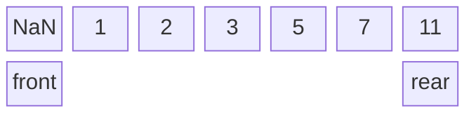
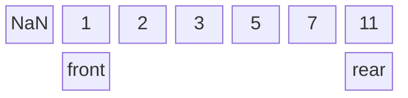
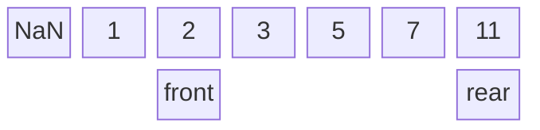
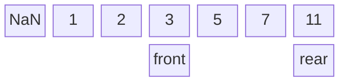
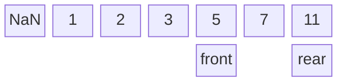
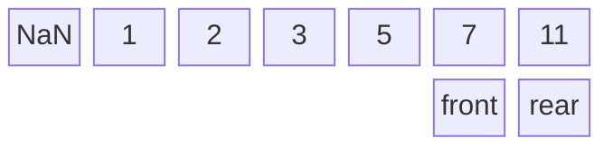
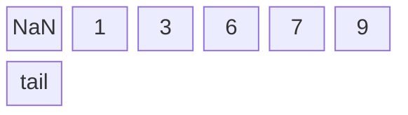

>[!WARNING]
>알고리즘의 큐와 구분되는 내용.

>[!NOTE]
>스택과 마찬가지로 [[큐(Queue)]]에 대한 개념이 없으면 이해하기 어려움
>또 [[스택]]문서를 이해했다는 가정하에 설명하기 때문에 해당 문서를 미리 읽는걸 추천

### <font color="orange">전체 코드(구버전)</font>
by. 3학년 정보 + 약간의 수정
```C
#include <stdio.h>
#define QUEUE_MAX 20

typedef int queue;

typedef struct {
	int front;
	int rear;
	queue data[QUEUE_MAX];
}Queuetype;

void reset_queue(Queuetype* one) {
	one->front = -1;
	one->rear = -1;
}

int empty(Queuetype* one) {
	if (one->front == one->rear) {
		return 1;
	}
	else {
		return 0;
	}
}

int full(Queuetype* one) {
	if (one->rear == QUEUE_MAX - 1) {
		return 1;
	}
	else {
		return 0;
	}
}

void enqueue(Queuetype* one, queue input) {
	if (full(one) == 1) {
		printf("Queue is full\n");
	}
	else {
		one->data[++(one->rear)] = input;
	}
}

queue dequeue(Queuetype* one) {
	if (empty(one) == 1) {
		printf("Queue is empty\n");
		return -1;
	}
	else {
		return one->data[++(one->front)];
	}
}

int main(void) {
	Queuetype one;
	reset_queue(&one);

	enqueue(&one, 1);
	enqueue(&one, 2);
	enqueue(&one, 3);
	enqueue(&one, 5);
	enqueue(&one, 7);
	enqueue(&one, 11);

	printf("%d | ", dequeue(&one));
	printf("%d | ", dequeue(&one));
	printf("%d | ", dequeue(&one));
	printf("%d | ", dequeue(&one));
	printf("%d | ", dequeue(&one));
	printf("%d | ", dequeue(&one));
	printf("%d | ", dequeue(&one));

	return 0;
}
```

**실행결과**
### <font color="orange">코드해석(구버전)</font>

```C
typedef int queue;

typedef struct {
	int front;
	int rear;
	queue data[QUEUE_MAX];
}Queuetype;
```

스택과 마찬가지로 구조체를 정의하고 있다. 스택과 다른점은 구조체에 새로운 정수형 변수 `rear`가 추가되는 것이다.

여기서의 `data`역시 정수형을 원소로 가지는 배열이다.

- `front` : **큐에서 데이터를 꺼내는 위치**이다. 큐는 FIFO(First In First Out)형식의 자료구조이므로 마지막 enqueue된 원소를 dequeue하는 것이 아닌 남겨져 있는 데이터 중 가장 먼저 들어온 데이터를 내보내야한다. **인덱스 상으로는 dequeue할 원소의 인덱스보다 1작다.**

- `rear` : 큐에 데이터를 넣는 위치이다. 때문에 항상 배열에서 **가장 마지막의 인덱스**를 가리키게 된다.

<hr>

```C
void reset_queue(Queuetype* one) {
	one->front = -1;
	one->rear = -1;
}
```

큐를 비우는 함수이다. 구조체 `Queuetype`의 두 변수 `front`와 `rear`를 -1로 초기화 해주고 있으며 인수로는 구조체 포인터 `one`을 받는다.

비어있는 큐라면 `front`와 `rear`가 유효하지 않은 인덱스를 가져야 한다. 따라서 두 변수의 값을 -1로 하여 스택과 같이 초기화한다.

<hr>

```C
int empty(Queuetype* one) {
	if (one->front == one->rear) {
		return 1;
	}
	else {
		return 0;
	}
}
```

큐가 비어있는지 확인하는 함수이다. 구조체 포인터 `one`을 인수로 받고 큐가 비어있으면 1 아니면 0을 반환한다.

스택과 달리 `front`라는 변수가 존재하기 때문에 우리는 `front`와 `rear`가 같을 때 큐가 비어있다고 할 수 있다. 

>[!TIP]
>스택에서 해당 함수를 구현하는 방식을 기억한다면 `top`이 -1일 때 스택이 비어있다고 정의했다는 것이 생각날 것이다. 그러면 왜 여기서는 `one->rear == -1` 일 때가 아닌 `one->front == one->rear`로 이를 판별하는지 의문이 생길 수 있다. 이는 문서 마지막의 실행 과정을 통해서 이해하자

<hr>

```C
int full(Queuetype* one) {
	if (one->rear == QUEUE_MAX - 1) {
		return 1;
	}
	else {
		return 0;
	}
}
```

큐가 가득 차있는지 확인하는 함수이다. 인수로 구조체 포인터 `one`을 요구한다. 큐가 가득 차있으면 1 아니면 0을 반환한다.

큐에 데이터를 정수형 배열로 저장했기 때문에 인덱스는 정수형 배열의 크기보다 크면 안된다. `QUEUE_MAX`를 20으로 정했으므로 배열에서 가장 마지막에 있는 원소의 인덱스는 19이다. 따라서 `rear`가 19번 인덱스를 가리킨다면 큐가 가득 차있다고 판단한다.

<hr>

```C
void enqueue(Queuetype* one, queue input) {
	if (full(one) == 1) {
		printf("Queue is full\n");
	}
	else {
		one->data[++(one->rear)] = input;
	}
}
```

큐의 연산인 enqueue(큐에 데이터를 넣는 연산)을 수행하는 함수이다. 인수로 구조체 포인터 `one`과 큐에 넣을 데이터인 `input`을 받는다. 어차피 `queue` = `int` 이기 때문에 `queue input`대신 `int input`이 와도 상관없다.

먼저 에러를 방지하기 위해 큐가 가득 차있는지 확인한다.(배열을 동적으로 선언 했다면 이럴 일 없다)

만약 큐에 데이터를 넣을 수 있는 상태라면 [[증감연산자#^7f752f|전위연산자]]를 사용하여 `data`의 `rear`가 가리키는 인덱스에 접근해 `rear`값을 1 증가시키고 그 위치에 `input`을 저장한다.(`rear`가 가리키는 인덱스에는 항상 배열의 마지막 값이 있음을 기억하자)

<hr>

```C
queue dequeue(Queuetype* one) {
	if (empty(one) == 1) {
		printf("Queue is empty\n");
	}
	else {
		return one->data[++(one->front)];
	}
}
```

큐의 연산인 dequeue(큐에서 원소를 제거하고 반환하는 연산)를 수행하는 함수이다. 인수로 구조체 포인터 `one`을 받는다.

비어있는 큐에서 dequeue연산을 할 수는 없기 때문에 큐가 비어있는지를 확인한다. 만약 큐가 비어있다면

큐가 비어있지 않은 상태라면 큐에서 데이터를 꺼내는 위치를 가리키고 있는 `front`에 접근한다. `front`는 원래 dequeue할 원소보다 1 작은 인덱스를 가지고 있기 때문에 전위 연산자를 통해 먼저 `front`에 1을 더하여 dequeue할 원소의 인덱스를 가리키게 한 다음, 이를 반환한다. 그러면 여전히 `front`는 다음에 dequeue할 원소보다 1 작은 인덱스를 가지게 된다.

<hr>

수업시간에 했는지 잘 모르겠음
```C
int peek(Queuetype* one) {
	if (empty(one) == 1) {
		printf("Queue is empty\n");
	}
	else {
		return one->data[(one->front)+1];
	}
}
```

peek 연산을 수행하는 함수이다. 구조체 포인터 `one`을 요구한다.

큐가 비어있으면 peek할 데이터가 없기 때문에 큐가 비어있음을 출력한다.

큐가 비어있지 않다면 `front`가 가리키는 인덱스를 변화시키지 않은 상태로 `front + 1`의 인덱스에 위치한 원소를 반환한다.

<hr>

```C
int main(void) {
	Queuetype one;
	reset_queue(&one);

	enqueue(&one, 1);
	enqueue(&one, 2);
	enqueue(&one, 3);
	enqueue(&one, 5);
	enqueue(&one, 7);
	enqueue(&one, 11);

	printf("%d | ", dequeue(&one));
	printf("%d | ", dequeue(&one));
	printf("%d | ", dequeue(&one));
	printf("%d | ", dequeue(&one));
	printf("%d | ", dequeue(&one));
	printf("%d | ", dequeue(&one));
	printf("%d | ", dequeue(&one));

	return 0;
}
```
**메인 함수**

`Queuetype`의 자료형 이름을 가진 구조체 `one`을 선언한다. 스택에서와 비슷하게 여기서 `one`은 구조체 포인터가 아닌 구조체의 이름이다.

이후 큐를 초기화 시키고 enqueue 연산을 실행한다. enqueue를 모두 마친 후에 큐는 다음과 같은 상태이다.



이제 여기서 dequeue 연산을 차례로 실행하면



```text
1 | 
```


```
1 | 2 |
```


```
1 | 2 | 3 |
```


```
1 | 2 | 3 | 5
```


```
1 | 2 | 3 | 5 | 7
```


```mermaid
block-beta
 columns 7
 NaN 1 2 3 5 7 11
 space:6 front=rear
```
```
1 | 2 | 3 | 5 | 7 | 11 |
```
여기까지가 dequeue연산을 6번째 수행 했을 때의 결과이고, 이제 `front`와`rear`의 값이 같으므로 dequeue 연산을 수행하면 결과가 다음과 같다.

```
1 | 2 | 3 | 5 | 7 | 11 | Queue is empty
| 15
```

왠 뜬금없이 15가 튀어나오는지 의문이 생길것인데, 이는 수업시간에 작성된 코드에서 dequeue 함수의 반환값이 void가 아닌 queue로 되어있기 때문에 큐가 비어있기 때문이다. 때문에 무조건 반환값을 필요로하는 main 함수 내에서는 쓰레기 값이 출력되는 것이다.

### <font color="orange">전체 코드</font>

>[!NOTE]
>수업시간 이후 수정된 버전(dequeue에 있었던 버그를 수정하고 `front`와 `rear` 변수 대신 구조체에 `tail`이라는 변수를 새로 추가)

```C
#include<stdio.h>
#define SIZE 10

int i = 0;

typedef struct {
    int tail;
    int data[SIZE];
}queue;

void reset_queue(queue* one) {
    one->tail = -1;
}

int empty(queue* one) {
    if (one->tail == -1)
        return 1;

    else
        return 0;
}

int full(queue* one) {
    if (one->tail == SIZE - 1)
        return 1;

    else
        return 0;
}

void enqueue(queue* one, int value) {
    if (full(one) == 1)
        printf("queue is full");

    else
        one->data[++(one->tail)] = value;
}

int predequeue(queue* one) {
    if (empty(one) == 1) {
        printf("queue is empty");
        return NULL;
    }
    else {
        return one->data[0];
    }
}

int dequeue(queue* one) {
    if (predequeue(one) == NULL) {
        return NULL;
    }
    else {
        int data = predequeue(one);
        for (int i = 0; i < SIZE - 2; i++) {
            one->data[i] = one->data[i + 1];
        }
        one->tail = one->tail - 1;
        return data;
    }
}

int main() {
    queue one;
    reset_queue(&one);
	
    enqueue(&one, 1);
    enqueue(&one, 3);
    enqueue(&one, 6);
    enqueue(&one, 7);
    enqueue(&one, 9);
	
    for (int w = 0; w < SIZE; w++) {
        printf("%d, %d\n", dequeue(&one), one.tail);
    }
	
    printf("%d\n", dequeue(&one));
    printf("%d\n", dequeue(&one));
    printf("%d\n", dequeue(&one));
    printf("%d\n", dequeue(&one));
    printf("%d\n", dequeue(&one));
}
```

### <font color="orange">코드 해석</font>

```C
#include<stdio.h>
#define SIZE 10

int i = 0;

typedef struct {
    int tail;
    int data[SIZE];
}queue;
```

헤더 파일 선언과 상수 `SIZE`를 선언하였다. 

구조체 `queue`를 정의하였다. 이전과는 달리 `rear`와 `front`가 아닌 `tail`만이 인덱스를 가리킨다.  `tail`은 **항상 큐의 마지막 원소 인덱스를 가리키고 있다**는 점을 유념하자. 즉, `tail`이 가리키는 원소는 가장 마지막으로 enqueue된 원소이다. 

<hr>

```C
void reset_queue(queue* one) {
    one->tail = -1;
}
```

스택과 비슷한 방법으로 `tail`값을 -1로 하여 큐를 초기화 한다.

<hr>

```C
int empty(queue* one) {
    if (one->tail == -1)
        return 1;

    else
        return 0;
}
```

큐에 원소가 있는지 확인 하는 함수, 구조체 포인터 `one`을 필요로 한다.

큐에 원소가 없어 `tail`값이 -1이라면 비었다고 판단하고 1을 반환하며, 그렇지 않다면 0을 반환한다.

<hr>

```C
int full(queue* one) {
    if (one->tail == SIZE - 1)
        return 1;

    else
        return 0;
}
```

`queue.data`가 가득 차있는지를 확인 하는 함수 구조체 포인터 `one`을 요구한다.

`SIZE`를 10이라 정의하였으므로 `tail`이 인덱스 9를 가리키고 있다면 배열 `queue.data`가 차있는 것이다. 따라서 1을 반환하며 그렇지 않을 경우 0을 반환한다.

<hr>

```C
void enqueue(queue* one, int value) {
    if (full(one) == 1)
        printf("queue is full");

    else
        one->data[++(one->tail)] = value;
}
```

큐의 연산 중 하나인 enqueue를 수행하는 함수 구조체 포인터 `one`과 입력되는 정수 `input`을 인수로 요구한다.

일단 큐에 데이터를 저장할 공간이 남아있는지를 `full` 함수로 확인한다. 큐에 공간이 남아있다면 `input`의 정수값을 전위연산자를 이용해 갱신된 `tail`의 값을 이용해`data[tail]`에 저장한다. `tail`의 값이 1 커졌기 때문에 여전히 enqueue된 마지막 원소인 `input`의 인덱스를 가리킨다.

<hr>

```C
int predequeue(queue* one) {
    if (empty(one) == 1) {
        printf("queue is empty");
        return NULL;
    }
    else {
        return one->data[0];
    }
}
```

peek이랑 같다. 다만, 뒤에 이어질 dequeue 방법이 `data`의 첫번째 원소인 `data[0]`을 제거하고 인덱스를 1개씩 줄이는 것이기 때문에 이와 비슷한 방법으로 `data[0]` 값을 반환한다.

큐가 비어있다면 peek할 원소가 없기 때문에 큐가 비어있음을 출력하고 `NULL`값을 반환한다.(그렇지 않으면 반환형이 int라 쓰레기 값이 반환된다.)

<hr>

```C
int dequeue(queue* one) {
    if (predequeue(one) == NULL) {
        return NULL;
    }
    else {
        int data = predequeue(one);
        for (int i = 0; i < SIZE - 2; i++) {
            one->data[i] = one->data[i + 1];
        }
        one->tail = one->tail - 1;
        return data;
    }
}
```

큐의 연산 중 하나인 dequeue를 수행하는 함수, 구조체 포인터 `one`을 요구한다.

먼저 큐에 dequeue할 원소가 있는지를 확인한다. 여기서는 `predequeue`를 활용하고 있으나 `empty`함수를 이용하여 `if(empty(one) == 1)` 와 같이 조건문을 작성하여도 좋다.

큐가 비어있지 않으면, 함수 내부에서 선언한 변수 `data`에 `queue.data[0]`값을 저장하고 반복문을 통해 k 번째 인덱스의 원소를 k-1째로 옮긴다.
`one->data[i] = one->data[i+1]`의 의미는 i+1 번째 원소를 i에 대입한다는 것이기 때문이다.

반복문이 모두 실행되었다면 배열의 마지막 값을 가리키는 `tail`의 값도 1 줄여준다.
그리고 배열에서 없어진 값 `data`를 반환한다.

>[!CAUTION]
>`for(int i = 0; i< SIZE -2; i++)`는 쓰레기 값까지 복사를 하게된다. 고로 올바른 범위는 `i < one->tail` 이다.

<hr>

```C
int main() {
    queue one;
    reset_queue(&one);

    enqueue(&one, 1);
    enqueue(&one, 3);
    enqueue(&one, 6);
    enqueue(&one, 7);
    enqueue(&one, 9);

    for (int w = 0; w < SIZE; w++) {
        printf("%d, %d\n", dequeue(&one), one.tail);

    }

    printf("%d\n", dequeue(&one));
    printf("%d\n", dequeue(&one));
    printf("%d\n", dequeue(&one));
    printf("%d\n", dequeue(&one));
    printf("%d\n", dequeue(&one));
}
```
**메인 함수**

먼저, 구조체 `queue`의 자료형을 가진 큐 `one`을 선언한다. 그리고 `one`을 가리키는 주소 `&one`을 이용해 큐를 초기화 시킨다.

이후 `enqueue`를 실행하여 만들어진 큐를 보면 다음과 같다.



가운데에 있는 반복문은 다음과 같은 결과를 출력한다.
```
1, 3
3, 2
6, 1
7, 0
9, -1
queue is empty0, -1
queue is empty0, -1
queue is empty0, -1
queue is empty0, -1
queue is empty0, -1
```
1행부터 5행까지의 첫 번째 값은 dequeue로 인해 반환된 값이고 `,`로 구분된 두 번째 값은 `queue.data`의 마지막 인덱스 `tail`의 값이다.
6행 부터는 `queue is empty`라는 문구와 함께 0이 같이 출력되는데 이는 `NULL`을 int 형으로 출력하였기 때문이다. `,` 뒤의 값은 여전히 `tail`의 값이다.

그 뒤로 `printf("%d\n", dequeue(&one));`을 실행하면 `queue is empty0`이 출력된다.